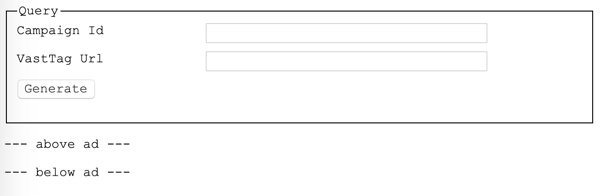
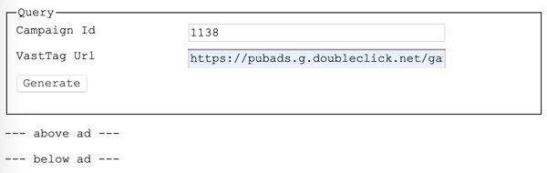
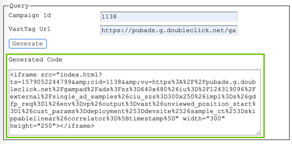
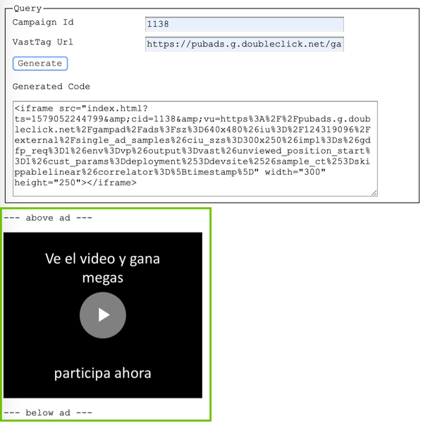

Create VastTag Code
===========

To create a custom Vast Tag code is necessary to open the generator file `/flows/vast/tag/generate.html` in your browser,

Two values are required to generate the code correctly,

|Name|Value|
|:----|:--------|
|Campaign Id| valid campaign Id (e.g. 1138)|
|VastTag Url| decoded valid url for vastTag video|

Example of `Decoded` VastTag Url,

`https://pubads.g.doubleclick.net/gampad/ads?sz=640x480&iu=/124319096/external/single_ad_samples&ciu_szs=300x250&impl=s&gdfp_req=1&env=vp&output=vast&unviewed_position_start=1&cust_params=deployment%3Ddevsite%26sample_ct%3Dskippablelinear&correlator=[timestamp]`

Once the information is entered click on "Generate" to create the vastTag code.

the generated code will be displayed below, just after the "Generate" button. This code consist of an iframe HTML element that can be used or embed into client's website. You only need to copy the code and share, the client will be able to place this code anywhere in his website without any additional configuration. 

The default size for the iframe element is 300x250px and it has NO CSS styles and borders applied.

Also, below the generated code, it will show a preview of the vastTag generated (between labels "above ad" and "below ad"). Using this preview you will be able to test, see messages and video content before sharing to the client.

Note: please consider both campaign Id and VastTag Url must be correct and valid in order to visualize the video content as expected.
