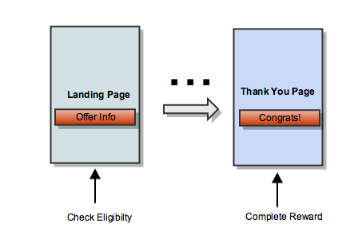

MoVE Rewards
===========

MoVE allows you to reward engagement with your brand through every step of the customer journey, increasing the number of new customers, while increasing engagement with existing customers.

# MoVE for Commerce (Multi-Page flow)

Reward customers with mobile data in a wide range of scenarios, such as making purchases, booking reservations, enrolling in notifications, and help increase add-on items during the purchase process while reducing cart abandonment.

The integration for the Multi-page MoVE Reward Commerce flow will occur in two places, the landing page, where the offer is displayed to the subscriber, and the thank you page, where the reward confirmation is displayed to the subscriber. During this flow Aquto will set a 3rd party cookie to register the beginning of the offer. This occurs when the initial offer is displayed to the subscriber, and is performed automatically by the API. The API reads the cookie again and it is used to perform the reward when the conversion occurs and the reward confirmation is displayed to the subscriber.



## Setup

This library must be included on both the landing page and thank you page. It can be embedded as a script tag:

```html
<script src="http://assets.aquto.com/moveRewards/aquto.min.js"></script>
```

When embedded as a script tag, it exposes the `aquto` global object.

We assume you are using a DOM manipulation library, such as jQuery. All examples below will assume jQuery $ syntax and should be called in `$(document).ready()` block.

## Check Eligibility

The `checkEligibility` method determines if the current user if eligible to receive the configured MB reward . This function also starts a reward session on the server that can be completed later. You should call `checkEligibility` on your landing page.

### Input arguments
|Key|Type|Required|Description|
|---|:----:|:--------:|-----------|
|campaignId|string|yes|ID for campaign setup by Aquto|
|callback|function|yes|Function called after checking eligibility on the server|
|phoneNumber|string|no|Manually entered user's phone number that can be used when user is on wifi|
|channel|string|no|Optional incent channel|

### Response properties
|Key|Type|Optional|Description|
|---|:--:|:------:|-----------|
|eligible|boolean|false|Is the current user eligible for the reward?|
|rewardAmount|integer|true|Reward amount in MB|
|rewardText|string|true|Server configured string containing carrier and reward amount. Ex: Purchase any subscription and get 1GB added to your AT&T data plan.|
|carrier|string|true|Code for user's carrier|


```html
<div class="rewardBlock">
  <div class="rewardHeader"></div>
  <div class="rewardText"></div>
</div>
```

```javascript
aquto.checkEligibility({
  campaignId: '12345',
  callback: function(response) {
    if (response && response.eligible) {
      $('.rewardText').text(response.rewardText);
      $('.rewardHeader').addClass('rewardHeader'+response.carrier);
      $('.rewardBlock').show();
    }
  }
});
```


## Complete Reward

The `complete` method finishes the reward session and triggers the MB reward. This method should be called on your thank you page.

### Input arguments
|Key|Type|Required|Description|
|---|:----:|:--------:|-----------|
|campaignId|string|yes|ID for campaign setup by Aquto|
|callback|function|yes|Function called after completing the reward on the server|

### Response properties
|Key|Type|Optional|Description|
|---|:--:|:------:|-----------|
|eligible|boolean|false|Is the user still eligible for the reward|
|rewardAmount|integer|true|Reward amount in MB|
|rewardText|string|true|Server configured string containing carrier and reward amount. Ex: Congratulations, you just added 1GB to your AT&T data plan!|
|carrier|string|true|Code for user's carrier|

```html
<div class="rewardBlock">
  <div class="rewardHeader"></div>
  <div class="rewardText"></div>
</div>
```

```javascript
aquto.complete({
  campaignId: '12345',
  callback: function(response) {
    if (response && response.eligible) {
      $('.rewardText').text(response.rewardText);
      $('.rewardHeader').addClass('rewardHeader'+response.carrier);
      $('.rewardBlock').show();
    }
  }
});
```

# MoVE for Commerce (Single-Page flow)

The single-page MoVE Reward Commerce flow is ideal for flows where the offer is displayed to the customer and they are rewarded for taking an action directly on that page, such as watching a video to completion. This flow does not utilize 3rd party cookies like the Multi-page MoVE Reward Commerce Flow, and instead returns a token when the offer is displayed to the customer. The same token is provided to the Javascript SDK when the user completes the offer and is shown the reward confirmation.

## Setup

This library must be included on the page. It can be embedded as a script tag:

```html
<script src="http://assets.aquto.com/moveRewards/aquto.min.js"></script>
```

When embedded as a script tag, it exposes the `aquto` global object.

## Check Eligibility

The `checkEligibilitySinglePage` method determines if the current user is eligible to receive the configured MB reward. This function also starts a reward session on the server that can be completed later.

### Input arguments
|Key|Type|Required|Description|
|---|:----:|:--------:|-----------|
|campaignId|string|yes|ID for campaign setup by Aquto|
|callback|function|yes|Function called after checking eligibility on the server|
|phoneNumber|string|no|Manually entered user's phone number that can be used when user is on wifi|
|channel|string|no|Incent channel string is used for reporting purposes|

### Response properties
|Key|Type|Optional|Description|
|---|:--:|:------:|-----------|
|eligible|boolean|false|Is the current user eligible for the reward?|
|userToken|string|false| Token that must be passed back to server when offer is completed|
|rewardAmount|integer|true|Reward amount in MB|
|rewardText|string|true|Server configured string containing carrier and reward amount. Ex: Purchase any subscription and get 1GB added to your AT&T data plan.|
|carrier|string|true|Code for user's carrier|


```html
<div class="rewardBlock">
  <div class="rewardHeader"></div>
  <div class="rewardText"></div>
</div>
```

```javascript
var userToken

aquto.checkEligibilitySinglePage({
  campaignId: '12345',
  callback: function(response) {
    userToken = response.useTokens
    if (response && response.eligible) {
      $('.rewardText').text(response.rewardText);
      $('.rewardHeader').addClass('rewardHeader'+response.carrier);
      $('.rewardBlock').show();
    }
  }
});
```

## Complete Reward

The `complete` method finishes the reward session and triggers the MB reward. The `complete` method must be executed within the same scope as the `userToken`

### Input arguments
|Key|Type|Required|Description|
|---|:----:|:--------:|-----------|
|campaignId|string|yes|ID for campaign setup by Aquto|
|callback|function|yes|Function called after completing the reward on the server|
|userToken|string|yes|Stored string that is returned by eligibility call|

### Response properties
|Key|Type|Optional|Description|
|---|:--:|:------:|-----------|
|eligible|boolean|false|Is the user still eligible for the reward|
|rewardAmount|integer|true|Reward amount in MB|
|rewardText|string|true|Server configured string containing carrier and reward amount. Ex: Congratulations, you just added 1GB to your AT&T data plan!|
|carrier|string|true|Code for user's carrier|

```html
<div class="rewardBlock">
  <div class="rewardHeader"></div>
  <div class="rewardText"></div>
</div>

<button onClick='complete()' />Finish</button>
```

```javascript
var complete = function() {
  aquto.complete({
    campaignId: '12345',
    userToken: userToken,
    callback: function(response) {
      if (response && response.eligible) {
        $('.rewardText').text(response.rewardText);
        $('.rewardHeader').addClass('rewardHeader'+response.carrier);
        $('.rewardBlock').show();
      }
    }
  });
}
```

# MoVE for Organic App Downloads

With MoVE for Organic App Installs you can reward users in real time with data for downloading your app. This removes the burden of cellular data usage for downloading your apps.

## Setup

This library must be included on the app download page. It can be embedded as a script tag:

```html
<script src="http://assets.aquto.com/moveRewards/aquto.min.js"></script>
```

When embedded as a script tag, it exposes the `aquto` global object.

We assume you are using a DOM manipulation library, such as jQuery. All examples below will assume jQuery $ syntax and should be called in `$(document).ready()` block.

## Pre-Qualification

The check eligibility call make take a few seconds due to communication with the carrier. To improve the performance of the eligibility call, you can include the following 1x1 pixel earlier in the user flow. We will cache the user's eligibility information and further calls to check eligibility should be faster.

```html

```

## Check Eligibility

The `checkAppEligibility` method determines if the current user if eligible to receive the configured MB reward . This function also starts a reward session on the server that can be completed later.

### Input arguments
|Key|Type|Required|Description|
|---|:----:|:--------:|-----------|
|campaignId|string|yes|ID for campaign setup by Aquto|
|callback|function|yes|Function called after checking eligibility on the server|
|phoneNumber|string|no|Manually entered user's phone number that can be used when user is on wifi|
|channel|string|no|Incent channel string is used for reporting purposes|

### Response properties
|Key|Type|Optional|Description|
|---|:--:|:------:|-----------|
|eligible|boolean|false|Is the current user eligible for the reward?|
|rewardAmount|integer|true|Reward amount in MB|
|rewardText|string|true|Server configured string containing carrier and reward amount. Ex: Purchase any subscription and get 1GB added to your AT&T data plan.|
|carrier|string|true|Code for user's carrier|
|clickUrl|string|true|Url to replace app download link|
|identified|boolean|true|Has the user's network been identified (i.e. network is known)?|


```html
<div class="rewardBlock">
  <div class="rewardHeader"></div>
  <div class="rewardText"></div>
</div>

<a class="continue" href="#">Get App</a>
```

```javascript
aquto.checkAppEligibility({
  campaignId: '12345',
  callback: function(response) {
    if (response && response.eligible) {
      $('.rewardText').text(response.rewardText);
      $('.rewardHeader').addClass('rewardHeader'+response.carrier);
      $('.rewardBlock').show();
    }
    if (response && response.clickUrl) {
      $('.continue').attr('href', response.clickUrl);
    }
  }
});
```

## Complete

In order to complete the conversion, you need to set up a server side callback through one of our integration partners.

* Adjust
* Tune
* Appsflyer
* Kochava

Select Aquto as publisher and provide iOS and Android click trackers to your Aquto account manager.
