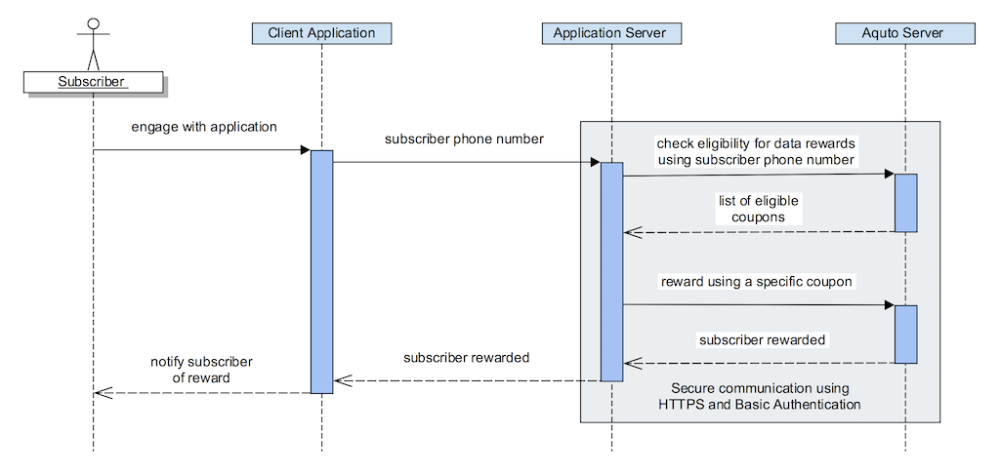

Aquto Data Rewards REST API
================================

This document describes the Aquto Data Rewards Server-Side API and its
functionality. The Data Reward API allows sponsors to interact with the
Aquto Portal when they want to provide a data reward to subscriber on
any operator supported by Aquto.



How to Send Requests
====================

Obtaining Credentials
---------------------

You can obtain your credentials for the Aquto Portal Data Reward Server
Side API by simply accessing the Aquto Portal
(<https://portal.aquto.com)> and creating an API Key and API Secret.
Whenever using the Data Reward Server-Side API, these credentials must
be provided.

Authentication and Security
---------------------------

The eligibility and redemption APIs use basic HTTP authentication using
authorization header. The API key should be used as the username and the
API secret should be used as the password. Since these credentials are
passed in each request, the API should only be invoked over HTTPS.

REST and JSON
-------------

The Data Rewards API uses a REST-like interface over HTTPS and uses HTTP
status codes to indicate whether or not the request was properly
serviced. JSON responses are used to communicate rich responses. 

***Possible HTTP Response Codes and VERBs***

The Data Rewards API uses the HTTP response code header to return
top-level response code of the request. Possible HTTP Header Response
Codes include:

-   200 - Everything was serviced correctly; no errors encountered

-   400 - Invalid JSON was supplied for a POST/PUT request

-   401 - An authentication related issue occurred with a request that
    required some sort of authentication

-   403 - Not authorized to invoke this request

-   404 - An invalid HTTP URI was requested, including incorrect path or
    missing request parameters

-   500 - An unexpected exception happened in the servicing of the
    request

***The Response Meta Entity***

All responses contain a meta entity that describes the response type.
The meta entity is required to have the code attribute, which mirrors
the HTTP header. In addition, error responses will contain additional
information in the meta entity including errorType and errorDetail
entities. See example below for more detail.

***The Response Entity***

In the case of a successful response, there may be a response entity as
well. The response entity contains additional information about the
results of the request and will contain method specific response
entities and attributes. 

***Error Example***

Error responses contain a type, code and errorDetail. The errorDetail
entity contains a code and some short text that describes the issue in
more detail. Errors **will not** contain a response entity. 


```
{
  "meta" : {
    "errorType" : "validation", //Indicates general category of error
    "code" : 500, //Will mirror the HTTP status code
    "errorDetail" : {
      "code" : "foo.some.issue", //Represents the particular failure scenario
      "shortText" : "You have a foo related issue" //A short text describing that scenario
    }
  }
}
```

***Success Example***

Success responses always return with an HTTP status code of 200. In most
cases (but not all), the success response will also contain a response
entity with method specific attributes and entities.

```
{
  "meta" : {
    "code" : 200
  },
  "response" : {
    "foo" : 1,
    "hello" : "world"    
  }
}
```

API Overview
============

The Data Reward API has 3 major functional areas; Network Based
Subscriber Identification (optional), eligibility, and rewarding.

API Details
===========

Network Based Subscriber Identification (Optional)
--------------------------------------------------

Network Based Subscriber Identification allows a sponsor to seamless
identify a mobile subscriber. This proprietary technology works by
placing a 1x1 pixel call on any of the sponsor's digital properties.
When the 1x1 pixel call is invoked, the sponsor passes the Aquto portal
their user identifier. If the subscriber is on cellular, the Aquto
portal will automatically detect the operator network (Verizon, AT&T,
etc.) and the specific subscriber on that network and associate the
sponsor's user identifier with the subscriber identifier on the
corresponding operator network.

This call must be made from the client when the sponsor's user is
interacting with the sponsor's digital properties, such as a mobile
application or mobile website. Since it is made client side there is no
need for authentication.

***HTTP vs. HTTPS***

The identification pixel will work properly over HTTP or HTTPS. However,
some operators still rely on HTTP based technology to perform the
identification of subscribers. If the pixel uses HTTP, then those
operators will automatically be disqualified for network based
subscriber identification. I.e.: Subscribers on those operators will not
be identified.

It is highly recommended that HTTP be used wherever possible.

|**Request Method**|GET|
|:---|:---|
|**Request URI**|//app.aquto.com/api/campaign/datarewards/pixel|

|Query Parameter|Type|Required|Description|
|:---|:---|:---|:---|
|**advertiserId**|Integer|Yes|Aquto provided advertiser identifier|
|**userIdentifier**|String|Yes|The sponsor provided user identifier. No restrictions on length.|
|**android_aid**|String|No|The Google Android advertising identifier of the device (AID)|
|**ios_idfa**|String|No|The Apple IOS advertising identifier of the device (IDFA)|

|**Response Content Type**|image/gif|
|:---|:---|
|**Response Description**|The API will always return success and the response can be safely ignored. <br>**Note:** The response may result in a redirect|

***Example***

```

```

Eligibility 
------------

Eligibility API allows a sponsor to check to see if an operator
subscriber is eligible for a campaign configured by the sponsor. The
sponsor provides the campaign id and an identifier for the user. The
identifier of the user can be either the phone number of the user or the
sponsor's own user identifier if Network Based Subscriber Identification
is used (see above).

|Request Method|GET|
|:---|:---|
|**Request URI**|https://app.aquto.com/api/datarewards/api/eligibility|

|Query Parameter|Type|Required|Description|
|:---|:---|:---|:---|
|**campaignId**|Integer|Yes|The Aquto portal generated campaign identifier of the sponsor’s campaign.|
|**advertiserId**|Integer|Conditional|The sponsors Aquto portal generated advertiser identifier. Required if userIdentifier is passed.|
|**userIdentifier**|String|Conditional|The sponsor’s user identifier. Only required if Network Based Subscriber Identification is used and phoneNumber is not provided.|
|**phoneNumber**|String|Conditional|The phone number of the subscriber. Only required if the userIdentifier is not provided.|

|Response Object|JSON Field|Type|Description|
|:---|:---|:---|:---|
|**Response**|response|Eligibility Response|See Eligibility Response definition.|
|**Eligibility Response**|eligible|Boolean|True if user is eligible|
|<!-- -->|operatorCode|String|The Aquto portal operator code. See the appendix for a list of supported operators and codes.|
|<!-- -->|coupons|Array of Coupons|See coupon object definition.|
|**Coupon**|couponId|Boolean|Identifier of coupon to be used for conversion.|
|<!-- -->|rewardAmountMB|Integer|The amount of the coupon in MB.|
|<!-- -->|term|Integer|The term of the reward (in minutes).|
|<!-- -->|price|Double|The price of the reward to the sponsor in the sponsor's currency.|
|<!-- -->|currency|String|The ISO-4217 currency code of the sponsor's currency.|
|<!-- -->|networkPrice|Double|The price of the reward in the network/operator's currency.|
|<!-- -->|networkCurrency|String|The ISO-4217 currency code of the operator's currency.|

***Example Request***

```
 GET /api/datarewards/api/eligibility?campaignId=123&phoneNumber=15554441212
```
***Example Response***

```
{
 "meta": {
  "code": 200
 },
 "response": {
  "eligible": true,
  "operatorCode": "opabc",
  "coupons": [
   {
    "couponId": 124,
    "rewardAmountMB": 10,
    "term": 1440,
    "price": 0.10,
    "currency": "USD",
    "networkPrice": 2.01,
    "networkCurrency": "MXN"
   },
   {
    "couponId": 245,
    "rewardAmountMB": 25,
    "term": 43200
    "price": 0.35,
    "currency": "USD",
    "networkPrice": 7.02,
    "networkCurrency": "MXN"
   }
  ]
 }
}
```

Reward
------

The Reward API allows a sponsor to reward a user. The sponsor provides
the campaign id, identifier for the user, and the coupon identifier they
wish to reward them with. The identifier of the user can be either the
phone number of the user or the sponsors own user identifier if Network
Based Subscriber Identification is used (see above).

|**Request Method**|POST|
|:---|:---|
|**Request URI**|https://app.aquto.com/api/datarewards/api/reward|

|Query Parameter|Type|Required|Description|
|:---|:---|:---|:---|
|**campaignId**|Integer|Yes|The Aquto portal generated campaign identifier of the sponsor’s campaign.
|**advertiserId**|Integer|Conditional|The sponsor’s Aquto portal generated advertiser identifier. Required if userIdentifer is passed.
|**userIdentifier**|String|Conditional|The sponsor’s user identifier. Only required if Network Based Subscriber Identification is used and phoneNumber is not provided.
|**phoneNumber**|String|Conditional|The phone number of the subscriber. Only required if the userIdentifier is not provided.
|**couponId**|Integer|Yes|Coupon identifier returned in the eligibility response. 
|**transactionId**|String|Conditional|Optional sponsor transactionId that will be logged with the transaction. Used for reconciliation purposes. 

|Response Object|JSON Field|Type|Description|
|:---|:---|:---|:---|
|**Response**|response|Reward Response|See Reward Response definition.|
|**Reward Response**|successful|Boolean|True if the transaction was successful.|
|<!-- -->|status|String|**success** - Conversion succeeded |
|<!-- -->|<!-- -->|<!-- -->|**unabletoidentify** - Unable to identify the user |
|<!-- -->|<!-- -->|<!-- -->|**ineligible** - Subscriber not eligible or campaign is inactive |
|<!-- -->|<!-- -->|<!-- -->|**unabletoconvert** - Unable to initiate conversion |
|<!-- -->|<!-- -->|<!-- -->|**generalerror** -  System error |
|<!-- -->|operatorCode|String|The Aquto portal operator code. See the appendix for a list of supported operators and codes.|
|<!-- -->|rewardAmountMB|Integer|The amount of the coupon in MB.|
|<!-- -->|transactionId|String|The Aquto transactionId of the transaction. Can be stored by the sponsor for future reconciliation.|
|<!-- -->|price|Double|The price of the reward to the sponsor in the sponsor’s currency.|
|<!-- -->|currency|String|The ISO-4217 currency code of the sponsor’s currency.|
|<!-- -->|networkPrice|Double|The price of the reward in the network/operator’s currency.|
|<!-- -->|networkCurrency|String|The ISO-4217 currency code of the operator’s currency.|


***Example Request***
```
POST /api/datarewards/api/reward
```

```
{
 "campaignId": 123,
 "phoneNumber": "15554441212"
 "couponId": 5
}
```

***Example Response***

```
{
 "meta": {
  "code": 200
 },
 "response": {
  "successful": true,
  "status": "success",
  "operatorCode": "opabc",
  "rewardAmountMB": 10,
  "transactionId": "cl_12345_123"
  "price": 0.35,
  "currency": "USD",
  "networkPrice": 7.02,
  "networkCurrency": "MXN"
 }
}
```
You can use Postman Collection (<https://www.getpostman.com/collection>) to manage, use and test our API Collection. Download our API Collection here [Aquto_REST_API.postman_collection.json](Aquto_REST_API.postman_collection.json)
