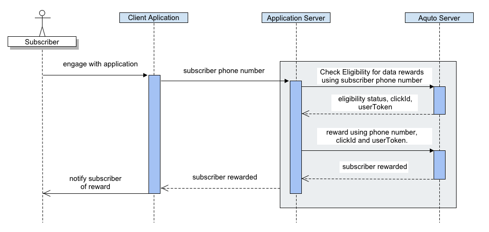

Aquto Data Rewards REST API (No Coupon List)
================================

This document describes the Aquto Data Rewards Server-Side API and its
functionality. The Data Reward API allows sponsors to interact with the
Aquto Portal when they want to provide a data reward to subscriber on
any operator supported by Aquto.



How to Send Requests
====================

Obtaining Credentials
---------------------

You can obtain your credentials for the Aquto Portal Data Reward Server
Side API by simply accessing the Aquto Portal
(<https://portal.aquto.com)>, and creating an API Key and API Secret.
Whenever using the Data Reward Server-Side API, these credentials must
be provided.

Authentication and Security
---------------------------

The eligibility and redemption APIs use basic HTTP authentication using
authorization header. The API key should be used as the username and the
API secret should be used as the password. Since these credentials are
passed in each request, the API should only be invoked over HTTPS.

REST and JSON
-------------

The Data Rewards API uses a REST-like interface over HTTPS and uses HTTP
status codes to indicate whether or not the request was properly
serviced. JSON responses are used to communicate rich responses. 

***Possible HTTP Response Codes and VERBs***

The Data Rewards API uses the HTTP response code header to return
top-level response code of the request. Possible HTTP Header Response
Codes include:

-   200 - Everything was serviced correctly; no errors encountered

-   400 - Invalid JSON was supplied for a POST/PUT request

-   401 - An authentication related issue occurred with a request that
    required some sort of authentication

-   403 - Not authorized to invoke this request

-   404 - An invalid HTTP URI was requested, including incorrect path or
    missing request parameters

-   500 - An unexpected exception happened in the servicing of the
    request

***The Response Meta Entity***

All responses contain a meta entity that describes the response type.
The meta entity is required to have the code attribute, which mirrors
the HTTP header. In addition, error responses will contain additional
information in the meta entity including errorType and errorDetail
entities. See example below for more detail.

***The Response Entity***

In the case of a successful response, there may be a response entity as
well. The response entity contains additional information about the
results of the request and will contain method specific response
entities and attributes. 

***Error Example***

Error responses contain a type, code and errorDetail. The errorDetail
entity contains a code and some short text that describes the issue in
more detail. Errors **will not** contain a response entity. 


```
{
  "meta" : {
    "errorType" : "validation", //Indicates general category of error
    "code" : 500, //Will mirror the HTTP status code
    "errorDetail" : {
      "code" : "foo.some.issue", //Represents the particular failure scenario
      "shortText" : "You have a foo related issue" //A short text describing that scenario
    }
  }
}
```

***Success Example***

Success responses always return with an HTTP status code of 200. In most
cases (but not all), the success response will also contain a response
entity with method specific attributes and entities.

```
{
  "meta" : {
    "code" : 200
  },
  "response" : {
    "foo" : 1,
    "hello" : "world"    
  }
}
```

API Overview
============

The Data Reward API has 2 major functional areas; Eligibility and rewarding.

API Details
===========

Eligibility 
------------

Eligibility API allows a sponsor to check to see if an operator
subscriber is eligible for a campaign configured by the sponsor. The
sponsor provides the campaign id and an identifier for the user. The
identifier of the user can be either the phone number of the user or the
sponsor's own user identifier if Network Based Subscriber Identification
is used (see above).

|Request Method|GET|
|:---|:---|
|**Request URI**|https://app.aquto.com/api/campaign/datarewards/eligibility/ &#60;campaignId&#62;|

|Query Parameter|Type|Required|Description|
|:---|:---|:---|:---|
|**phoneNumber**|String|Yes|The phone number of the subscriber.Phone Number must contain country code.|

|Response Object|JSON Field|Type|Description|
|:---|:---|:---|:---|
|**Response**|response|Eligibility Response|See Eligibility Response definition.|
|**Eligibility Response**|eligible|Boolean|True if user is eligible.|
|<!-- -->|operatorCode|String|The Aquto portal operator code. See the appendix for a list of supported operators and codes.|
|<!-- -->|displayText|String|Message to show if eligible(Not required).|
|<!-- -->|rewardAmountMB|Integer|The amount of the coupon in MB.|
|<!-- -->|clickId|String|Aquto unique identifier.|
|<!-- -->|userToken|String|Token that must be passed back to server when offer is completed. Valid for 25 days.|
|<!-- -->|status|Boolean|'eligible' if phone number is eligible. |

***Example Request***

```
 GET api/campaign/datarewards/eligibility/3778?phoneNumber=525540863512
```
***Example Response***

```
{
    "meta": {
        "code": 200
    },
    "response": {
        "status": "eligible",
        "operatorCode": "telcelrw",
        "displayText": "congrats!",
        "rewardAmountMB": 100,
        "clickId": "cl_5a406f71-2cc1-4a17-a6d6-af345e181f4b_3778",
        "userToken": "eyJhbGciOiJkaXIiLCJlbmMiOiJBMjU2Q0JDLUhTNTEyIiwiY3R5IjoiSldUIn0..vC2h2XKPTXOhCuvVgLuVsg.4706VW4oW8xEvWM3JmKs769jInS2E8BNI_6hXhsElbIOjwkRVeV2fscWRBxwtZ_tyDF5P0bSzjjhaizz_jNZg7TJVagLF28b64LPYAfHDWHsSD5nU13zrqPYoasEYCDhYFI7BaRx3BcepS5Zi5jTPMdWzzE8uUR8sl34KVM9gkHQgsYnptxzkp-te9YEO6DC5PV-3KTadvCtwizB0x4m4y-RQdg16MvIXRMD8Nt0GYmm7QF_3UgigJqn8JWdqfyjl-o1pHBJ6C3VznGbm1nJ9g.1pQZ2Pq5TSaQgBaF42QFn2RHSpOFbVe_G-VWMDligZM",
        "eligible": true
    }
}
```

Reward
------

The Reward API allows a sponsor to reward a user. Use the phone number, clickId and userToken from response object
 on Eligibility request. 
 
|**Request Method**|GET|
|:---|:---|
|**Request URI**|https://app.aquto.com/api/campaign/datarewards/applyreward/ &#60;campaignId&#62;?phoneNumber=&#60;phoneNumber&#62;&clickId=&#60;clickId&#62;|

|Query Parameter|Type|Required|Description|
|:---|:---|:---|:---|
|**phoneNumber**|String|Yes|The phone number of the subscriber.
|**clickId**|String|Yes|ClickId returned in the eligibility response.
|**userToken**|String|Yes|userToken returned in the eligibility response.

|Response Object|JSON Field|Type|Description|
|:---|:---|:---|:---|
|**Response**|response|Reward Response|See Reward Response definition.|
|**Reward Response**|status|String|'eligible' if the transaction was successful.|
|<!-- -->|<!-- -->|<!-- -->|**unabletoidentify** - Unable to identify the user |
|<!-- -->|<!-- -->|<!-- -->|**ineligible** - Subscriber not eligible or campaign is inactive |
|<!-- -->|<!-- -->|<!-- -->|**unabletoconvert** - Unable to initiate conversion |
|<!-- -->|<!-- -->|<!-- -->|**generalerror** -  System error |
|<!-- -->|operatorCode|String|The Aquto portal operator code. See the appendix for a list of supported operators and codes.|
|<!-- -->|displayText|String|Message to show if eligible(Not required).|
|<!-- -->|rewardAmountMB|Integer|The amount of the coupon in MB.|
|<!-- -->|eligible|Boolean|**eligible** - True if phone number is eligible. |


***Example Request***
```
GET /api/campaign/datarewards/applyreward/3778?phoneNumber=525540863512&clickId=cl_...(truncated)&userToken
=eyJhbGciOi...(truncated)
```

***Example Response***

```
{
    "meta": {
        "code": 200
    },
    "response": {
        "status": "eligible",
        "operatorCode": "telcelrw",
        "displayText": "congrats!",
        "rewardAmountMB": 100,
        "eligible": true
    }
}
```
You can use Postman Collection (<https://www.getpostman.com/collection>) to manage, use and test our API Collection. Download our API Collection here [DataRewardsAPI(NoCouponList).postman_collection.json](DataRewardsAPI(NoCouponList).postman_collection.json)
