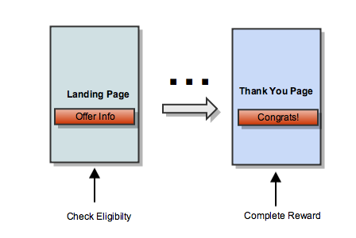

MoVE for Commerce (Multi-Page flow)
===================================

Reward customers with mobile data in a wide range of scenarios, such as making purchases, booking reservations, enrolling in notifications, and help increase add-on items during the purchase process while reducing cart abandonment.

The integration for the Multi-page MoVE Reward Commerce flow will occur in two places, the landing page, where the offer is displayed to the subscriber, and the thank you page, where the reward confirmation is displayed to the subscriber. During this flow Aquto will set a 3rd party cookie to register the beginning of the offer. This occurs when the initial offer is displayed to the subscriber, and is performed automatically by the API. The API reads the cookie again and it is used to perform the reward when the conversion occurs and the reward confirmation is displayed to the subscriber.

Setup
---------

This library must be included on both the landing page and thank you page. It can be embedded as a script tag:

.. code-block:: html

  

When embedded as a script tag, it exposes the ``aquto`` global object.

We assume you are using a DOM manipulation library, such as jQuery. All examples below will assume jQuery $ syntax and should be called in ``$(document).ready()`` block.

Check Eligibility
---------------------

The ``checkEligibility`` method determines if the current user if eligible to receive the configured MB reward . This function also starts a reward session on the server that can be completed later. You should call ``checkEligibility`` on your landing page.

Input arguments
~~~~~~~~~~~~~~~~

+------------+----------+----------+----------------------------------------------------------+
|    Key     |   Type   | Required |                       Description                        |
+------------+----------+----------+----------------------------------------------------------+
| campaignId | string   | yes      | ID for campaign setup by Aquto                           |
+------------+----------+----------+----------------------------------------------------------+
| callback   | function | yes      | Function called after checking eligibility on the server |
+------------+----------+----------+----------------------------------------------------------+

Response properties
~~~~~~~~~~~~~~~~~~~~

+--------------+---------+----------+-------------------------------------------------------------------------+
|     Key      |   Type  | Optional |                               Description                               |
+--------------+---------+----------+-------------------------------------------------------------------------+
| eligible     | boolean | false    | Is the current user eligible for the reward?                            |
+--------------+---------+----------+-------------------------------------------------------------------------+
| rewardAmount | integer | true     | Reward amount in MB                                                     |
+--------------+---------+----------+-------------------------------------------------------------------------+
| rewardText   | string  | true     | Server configured string containing carrier and reward amount.          |
|              |         |          | Ex: Purchase any subscription and get 1GB added to your AT&T data plan. |
+--------------+---------+----------+-------------------------------------------------------------------------+
| carrier      | string  | true     | Code for user's carrier                                                 |
+--------------+---------+----------+-------------------------------------------------------------------------+

.. code-block:: html

  

    

    

  

.. code-block:: javascript

  aquto.checkEligibility({
    campaignId: '12345',
    callback: function(response) {
      if (response && response.eligible) {
        $('.rewardText').text(response.rewardText);
        $('.rewardHeader').addClass('rewardHeader'+response.carrier);
        $('.rewardBlock').show();
      }
    }
  });

Complete Reward
-----------------

The ``complete`` method finishes the reward session and triggers the MB reward. This method should be called on your thank you page.

Input arguments
~~~~~~~~~~~~~~~~~

+------------+----------+----------+-----------------------------------------------------------+
|    Key     |   Type   | Required |                        Description                        |
+------------+----------+----------+-----------------------------------------------------------+
| campaignId | string   | yes      | ID for campaign setup by Aquto                            |
+------------+----------+----------+-----------------------------------------------------------+
| callback   | function | yes      | Function called after completing the reward on the server |
+------------+----------+----------+-----------------------------------------------------------+

Response properties
~~~~~~~~~~~~~~~~~~~~

+--------------+---------+----------+-----------------------------------------------------------------+
|     Key      |   Type  | Optional |                           Description                           |
+--------------+---------+----------+-----------------------------------------------------------------+
| eligible     | boolean | false    | Is the user still eligible for the reward                       |
+--------------+---------+----------+-----------------------------------------------------------------+
| rewardAmount | integer | true     | Reward amount in MB                                             |
+--------------+---------+----------+-----------------------------------------------------------------+
| rewardText   | string  | true     | Server configured string containing carrier and reward amount.  |
|              |         |          | Ex: Congratulations, you just added 1GB to your AT&T data plan! |
+--------------+---------+----------+-----------------------------------------------------------------+
| carrier      | string  | true     | Code for user's carrier                                         |
+--------------+---------+----------+-----------------------------------------------------------------+

.. code-block:: html

  

    

    

  

.. code-block:: javascript

  aquto.complete({
    campaignId: '12345',
    callback: function(response) {
      if (response && response.eligible) {
        $('.rewardText').text(response.rewardText);
        $('.rewardHeader').addClass('rewardHeader'+response.carrier);
        $('.rewardBlock').show();
      }
    }
  });
